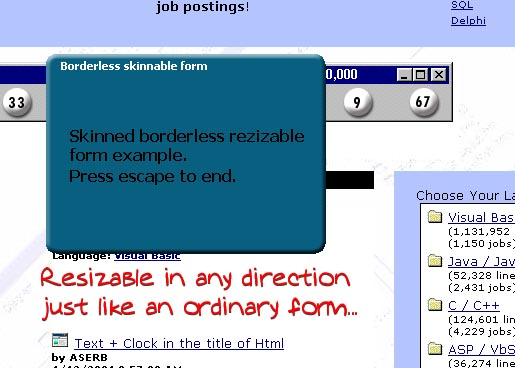



## Borderless resizable, skinnable form

### Description

<strong>This is an example on how to create borderless, resizable and skinned forms.

It would be nice with some comments(and votes to;P)
 
### More Info
 

             |
---                |---
**Submitted On**   |2001-02-05 12:10:02
**By**             |[Daniel Räinä](https://github.com/Planet-Source-Code/PSCIndex/blob/master/ByAuthor/daniel-r-in.md)
**Level**          |Beginner
**User Rating**    |4.1 (62 globes from 15 users)
**Compatibility**  |VB 6\.0
**Category**       |[Custom Controls/ Forms/  Menus](https://github.com/Planet-Source-Code/PSCIndex/blob/master/ByCategory/custom-controls-forms-menus__1-4.md)
**World**          |[Visual Basic](https://github.com/Planet-Source-Code/PSCIndex/blob/master/ByWorld/visual-basic.md)
**Archive File**   |[CODE\_UPLOAD14543252001\.zip](https://github.com/Planet-Source-Code/daniel-r-in-borderless-resizable-skinnable-form__1-15022/archive/master.zip)

